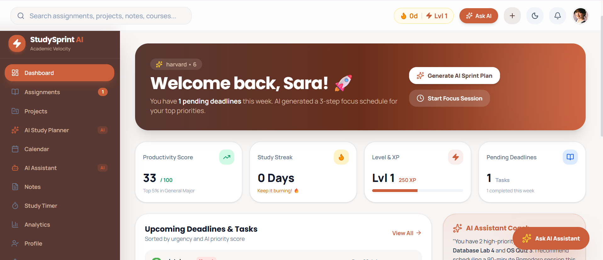
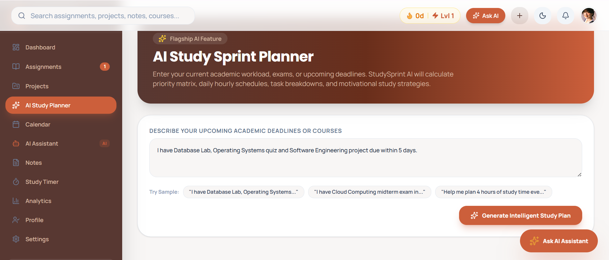
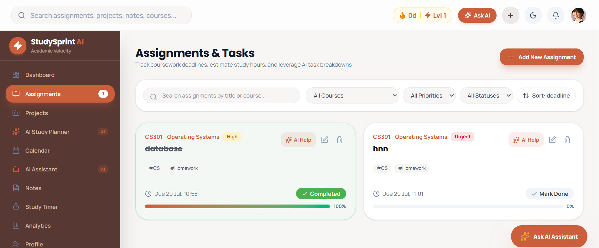
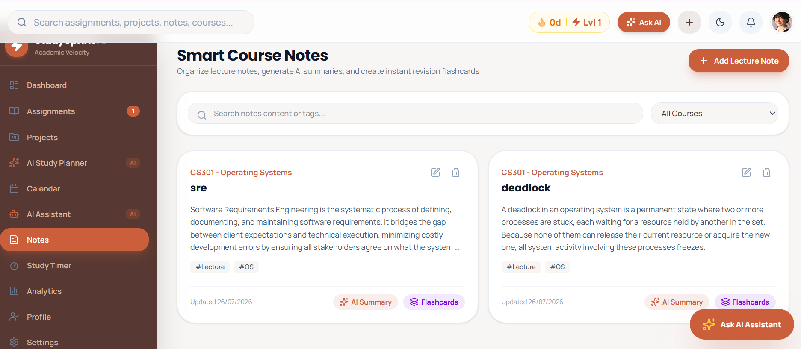
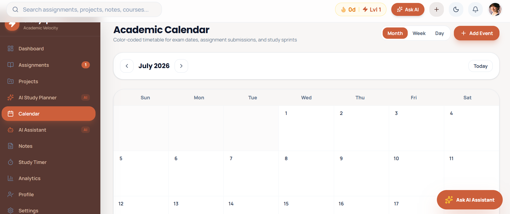
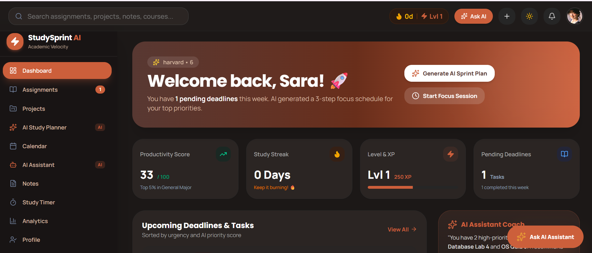
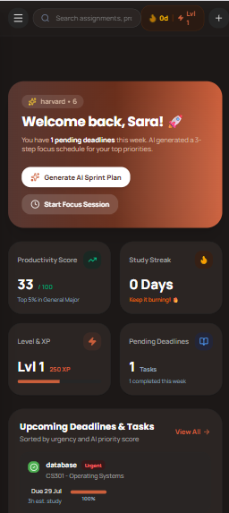
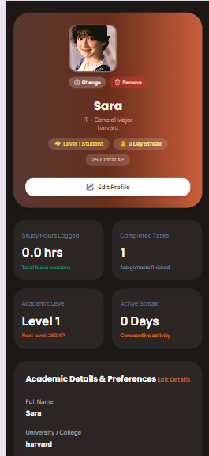
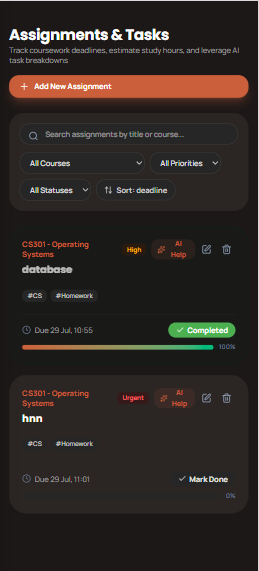

# 🎓 StudySprint AI

> **An AI-powered academic productivity platform that helps university and college students organize their academic life, stay on top of deadlines, and study more effectively through intelligent planning and personalized recommendations.**

---

# 📚 Overview

**StudySprint AI** is a modern academic productivity platform designed specifically for university and college students. It combines task management, study planning, note organization, and AI-powered academic assistance into a single, intuitive application.

Students often juggle assignments, projects, quizzes, exams, lecture notes, and deadlines across multiple platforms such as Google Classroom, Notes apps, calendars, messaging applications, and spreadsheets. This fragmented workflow makes it difficult to prioritize work, manage time effectively, and maintain consistent study habits.

StudySprint AI addresses this challenge by centralizing academic planning in one platform while leveraging artificial intelligence to create personalized study plans, intelligently break down complex assignments into manageable tasks, recommend study schedules based on deadlines and workload, and improve students' overall productivity.

Unlike a traditional chatbot, the AI is deeply integrated throughout the application and acts as an intelligent academic assistant that enhances the user's workflow without replacing it.

---

# 🎯 Problem Statement

Students commonly experience:

* Managing assignments across multiple applications.
* Missing important deadlines.
* Difficulty prioritizing academic tasks.
* Poor time management.
* Last-minute exam preparation.
* Lack of structured study plans.
* Information scattered across different platforms.

StudySprint AI solves these problems by providing one intelligent workspace where students can manage every aspect of their academic life.

---

# 👥 Target Users

* University Students
* College Students
* Undergraduate Students
* Postgraduate Students
* Learners preparing for examinations
* Students managing multiple courses simultaneously

---

# 🚀 Live Application

**Live URL**
>
https://studysprint-ai-nu.vercel.app/


# ✨ Features

## Academic Dashboard

* Personalized dashboard
* Academic progress overview
* Upcoming deadlines
* Daily productivity summary
* Recent activities

---

## Assignment Management

* Create assignments
* Edit assignments
* Delete assignments
* Assignment status tracking
* Due date management
* Priority levels
* Subject categorization

---

## Project Management

* Manage semester projects
* Track milestones
* Organize project tasks
* Monitor completion progress

---

## Study Planner

* AI-generated study schedules
* Personalized daily plans
* Weekly planning
* Intelligent workload distribution
* Adaptive study recommendations

---

## Smart Task Management

* Task creation
* Priority management
* Completion tracking
* Due date reminders
* Progress visualization

---

## Notes Management

* Organize study notes
* Subject-based categorization
* Easy note access
* Academic reference storage

---

## Calendar & Scheduling

* Academic calendar
* Exam schedule
* Assignment deadlines
* Study sessions
* Important academic events

---

## Progress Tracking

* Completed tasks
* Study statistics
* Productivity insights
* Academic performance overview

---

## Authentication

* Secure Firebase Authentication
* Google Sign-In
* Protected user data

---

## Cloud Storage

* Secure cloud database
* Real-time synchronization
* Persistent academic data

---

# 🤖 AI Feature

StudySprint AI integrates artificial intelligence directly into the academic workflow instead of functioning as a standalone chatbot.

## AI Responsibilities

The AI assistant can:

* Generate personalized study plans
* Break large assignments into smaller actionable tasks
* Recommend study priorities
* Suggest efficient study schedules
* Balance workload across available time
* Improve productivity through intelligent recommendations
* Help students prepare for exams
* Reduce academic overload by organizing work efficiently

## AI System Prompt

The AI is instructed to act as an intelligent academic productivity assistant rather than a conversational chatbot.

Its primary responsibilities include:

* Assisting students with planning their academic workload.
* Creating realistic study schedules.
* Prioritizing assignments according to deadlines and difficulty.
* Breaking complex academic tasks into achievable steps.
* Encouraging productive and healthy study habits.
* Providing concise, actionable recommendations.
* Remaining focused on academic productivity and organization.

---

# 🛠 Technology Stack

## Frontend

* React
* TypeScript
* Vite
* Tailwind CSS

## Backend

* Node.js
* TypeScript

## Database

* Firebase Firestore

## Authentication

* Firebase Authentication

## Cloud Storage

* Firebase Storage

## Artificial Intelligence

* Google Gemini API

## Development Tools

* Google AI Studio
* Visual Studio Code
* Git
* GitHub
* Vercel

---

# 🧠 AI Models Used

* Google Gemini

Gemini 2.5 Flash

---

# 📸 Application Screenshots

## Dashboard

>
> 
>

---

## Study Planner



---

## Assignment Management



---

## Notes



---

## Calendar



---

## Darkmode



---

## Mobile view



---

## Profile



---

## assignments



---

# ⚙️ Installation & Local Setup

## Clone the repository

```bash
git clone https://github.com/Qurat-hub/Studysprint-AI
```

---

## Navigate into the project

```bash
cd studysprint-ai
```

---

## Install dependencies

```bash
npm install
```

---

## Configure Environment Variables

Create a `.env` file and add:

```env
GEMINI_API_KEY=YOUR_GEMINI_API_KEY

VITE_FIREBASE_API_KEY=YOUR_FIREBASE_API_KEY
VITE_FIREBASE_AUTH_DOMAIN=YOUR_FIREBASE_AUTH_DOMAIN
VITE_FIREBASE_PROJECT_ID=YOUR_FIREBASE_PROJECT_ID
VITE_FIREBASE_STORAGE_BUCKET=YOUR_FIREBASE_STORAGE_BUCKET
VITE_FIREBASE_MESSAGING_SENDER_ID=YOUR_FIREBASE_MESSAGING_SENDER_ID
VITE_FIREBASE_APP_ID=YOUR_FIREBASE_APP_ID
VITE_FIREBASE_DATABASE_ID=(default)
```

---

## Start the development server

```bash
npm run dev
```

Open:

```
http://localhost:5173
```

---

# 📁 Project Structure

```
StudySprint AI
│
├── src/
├── components/
├── pages/
├── services/
├── hooks/
├── server.ts
├── public/
├── package.json
└── README.md
```

---

# Future Improvements

* AI-powered exam preparation
* Flashcard generation
* Smart reminders
* Collaborative study groups
* Cross-device synchronization
* Offline support
* Mobile application
* Learning analytics
* Habit tracking
* Course performance insights

---

# Author

**Qurat Ul Ain**

BS Information Technology

University Student | UI/UX Designer | Frontend Developer

---

# License

This project was developed for academic and educational purposes.
